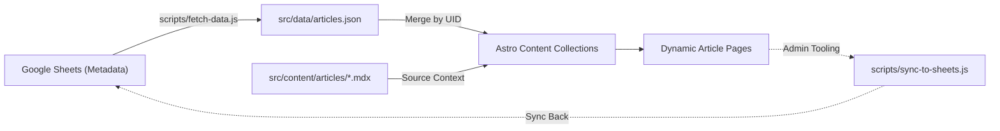

## 콘텐츠 관리 아키텍처

### 사이트 콘텐츠 맵

| 레벨 1 (Main) | 레벨 2 (Sub/Dynamic) | 설명 | 파일 경로 |
| :--- | :--- | :--- | :--- |
| **홈 (`/`)** | - | 랜딩 페이지 | `src/pages/index.astro` |
| **아티클 (`/article`)** | `/[slug]` | 개별 데이터 스토리텔링 콘텐츠 상세 페이지 | `src/pages/article/[...slug].astro` |
| **소개 (`/about`)** | - | 프로젝트 및 운영자 정보 | `src/pages/about.astro` |

#### 콘텐츠 유형

- 콘텐츠는 다음 세 가지 유형으로 나눈다. 
    - ^`page`: 정적인 정보성 페이지 (기존 `page`로 정의)
      - 레벨 1 (Main): `/about`
      - 레벨 2 (Sub/Dynamic): `/about/[slug]`
    - ^`article`:  일반적인 데이터 저널리즘 기사 (기존 `article`로 정의)
      - 레벨 1 (Main): `/article`
      - 레벨 2 (Sub/Dynamic): `/article/[slug]`
    - ^`poster`: 시각화 중심의 인터랙티브 콘텐츠 (기존 `graphics`로 정의)
      - 레벨 1 (Main): `/article`
      - 레벨 2 (Sub/Dynamic): `/article/[slug]`

#### 콘텐츠 핵심 데이터 스키마 (Article Schema)

- `src\content.config.ts`에서 관리한다. 해당 파일은 P1이다.
- 아티클 객체(article.data)는 다음과 같은 핵심 필드를 포함한다. 각 필드의 주석은 사용자가 직접 작성하므로 아래 설명보다 해당 파일의 주석을 우선으로 한다.
  - flytitle: an in 2 ~ 4 words of inviting phrase characterizing the issue, little enigmatic.
  - headline:  is a title clarifies people what is going on. It is informative than attractive.
  - rubric: a catchy phrase draws the reader whether s/he is interested in the article or not. It is attractive than informative.
  - slug: An SEO friendly conversion of headline 
  - date (Date): 발행일.
  - tags (string[]): 태그 목록.
  - revisions (Array<{ timestamp: string, ... }>): 수정 내역 배열. (정렬 로직의 기준이 됨)

#### 콘텐츠 데이터 스키마의 관리

- 메타데이터 가운데 정적 텍스트 기반으로 관리하는 항목을 Google Sheets에서 관리한다.
  - 이미지, 수정 이력 등은 MDX에서 관리한다.
  - fetch‑data.js
    - 빌드 시점에 실행되어 Google Sheets API를 호출하고, 시트 데이터를 JSON 형태(src\data\articles.json 등)로 변환한다.
    - Astro 프레임워크가 빌드 과정에서 이 JSON 파일을 읽어 페이지에 메타데이터가 채운다.
  - sync‑to‑sheets.js
    - 초기 시트 생성·구조 설정용 스크립트이며, 한 번만 실행한다.
    - 기존 시트에 데이터를 동기화하거나 업데이트하는 용도가 아니라, 프로젝트를 처음 시작할 때 시트 템플릿을 만들고 기본값을 넣는 역할을 한다.

#### 콘텐츠 관리 및 관리 아키텍처

- 콘텐츠 데이터 접근은 반드시 astro:content의 getCollection 함수를 사용해야 한다.
- 페이지는 아티클 외에 이 사이트의 시스템과 기능을 구성하는 일반 페이지의 단위이다. 해당 페이지는 `src/pages/`에서 `.astro` 형식으로 관리한다. 
- **Flow**: 
  1. **Source**: Google Sheets (데이터 관리 주체)
  2. **Fetch**: `scripts/fetch-data.js` (Node.js를 통한 API 호출 및 데이터 수집)
  3. **Validate**: Zod를 사용하여 기술 스키마와 콘텐츠 규칙 검증
  4. **Emit**: `src/data/articles.json` (Astro 빌드 시 참조될 정적 에셋 생성)
  5. **Render**: `src/content.config.ts`에서 JSON과 MDX를 병합하여 콘텐츠 컬렉션 생성

#### 콘텐츠 관리 파이프 라인

- **Data Sourcing Strategy**
  - 모든 정적 메타데이터(flytitle, headline 등)는 Google Sheets에서 관리한다.
  - 본문 텍스트, 상호작용 콤포넌트 local MDX에서 관리한다.
- **UID Matching**: 시트의 `uid`와 MDX의 `id`가 일치해야 정상적으로 병합된다.

### 