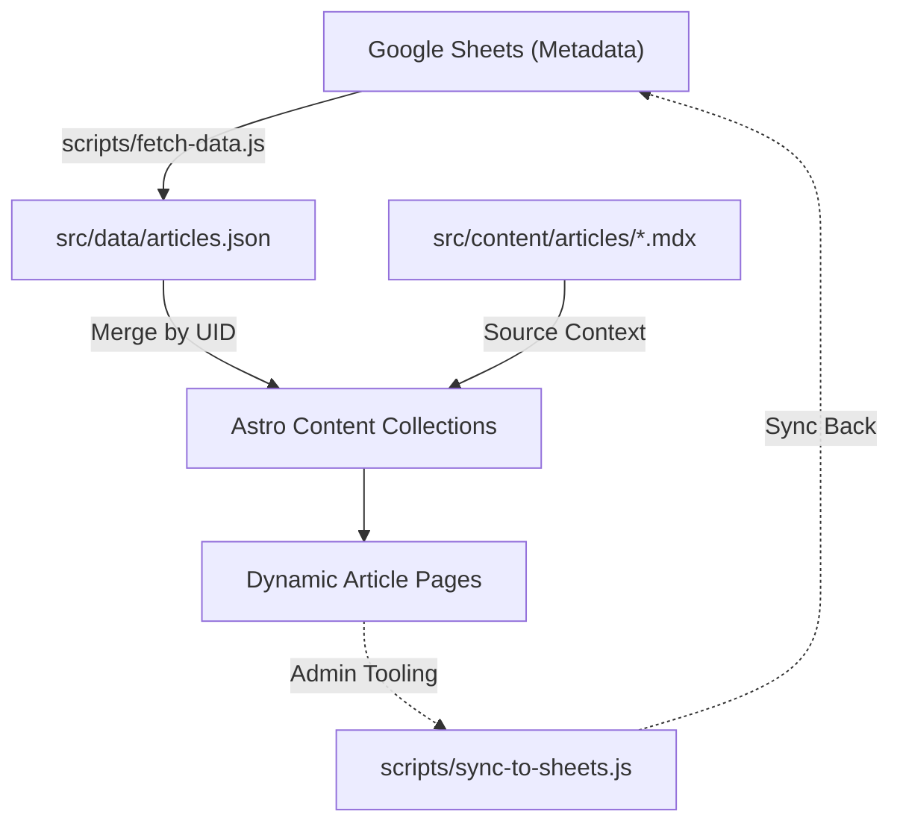

# Development Rules

- 이 문서는 o-m.kr 프로젝트 개발 과정에서 에이전트가 반드시 따라야 할 기술 분야의 규칙을 정의한다. 
- 이 규칙은 `instructions.md`의 **[비판적 허용]**, **[목적 지향]**, **[미래 예측]** 원칙을 기술적으로 실현하기 위한 하부 가이드라인이다.
- `^`표시가 앞에 있는 항목은 현재 검토 중이며 추후 개선 뒤 변경할 수 있다.

## Stacks

### Core Stack

- Framework: Astro 5.x (Static Site Generation 기반)
  - **Astro v6 Ready**: 향후 업그레이드를 고려하여 공식 문서에서 deprecated가 예정된 API는 사용하지 않는다.
- Visualization: D3.js v7 (no React wrappers)
- Animation: GSAP 3.x + Lenis (smooth scroll)
- Styling: TailwindCSS v4 (utility-first) + FlyonUI (Tailwind 플러그인 기반 컴포넌트)
- ^Data Sourcing: Google Sheets → Build-time JSON

### Deployment

- 서비스 도메인: o-m.kr (도메인 확보 완료)
- 홍보 및 개발용 도메인: dev.o-m.kr
 - 선행 홍보의 일환으로 개발 과정을 배포 중.
 - 로컬 Logseq에 개발 일지 작성 후 Logseq-SPA GitHub Action을 통해 GitHub Pages에 배포 중.
  - 해당 logseq 그래프의 위치는 `d:\yonggeun\porter\git\o-m.kr\journal\`이다.
- ^웹사이트 배포는 github action으로 cloudflare혹은 vercel 가운데 하나를 택한다.

### Dev Environment

- IDE: Antigravity
- Runtime: Node.js
- Package Manager: npm
- Language: JavaScript 기반. 외부 라이브러리 및 모듈 정의 외에는 TypeScript를 사용하지 않는다.
- 개발 서버는 반드시 HTTPS로 접속한다. (@vitejs/plugin-basic-ssl 사용)

## Programming Rule (Priority A)

### Agent Rule

- 코드 생산성보다 사용자의 로직 이해 및 가독성을 우선한다.
- **[영향도 분석 보고]**: 두 개 이상의 파일에서 도합 100줄 이상이 변경되는 대규모 변경이나 신규 코드 혹은 핵심 로직 추가 및 변경 시, 구현에 앞서 다음 내용을 포함한 보고서를 제출하고 사용자의 확인을 거쳐야 한다.
  - 변경 사유와 로직 요약
  - **[미래 영향]**: 향후 데이터 확장 및 스크롤리텔링 구현 시의 이점 또는 제약 사항
  - **[대안 제시]**: 현재의 '방법(How)' 외에 ROI가 더 높은 기술적 대안이 있는지 검토 결과
- 파일 신규 생성, 삭제, 핵심 로직 변경 및 **Git 커밋(commit)**은 사용자의 확인과 지시를 거친 뒤에만 시작할 수 있다.
- 단순 분석 지시를 코드 수정 지시로 임의 해석하지 않는다.

### Data Architecture

#### 프로젝트 구조 및 핵심 파일 및 폴더 (Project Structure)

/
├── .agent/                      # AI 에이전트 지침 및 기록 폴더
│   ├── rules/                   # 에이전트 행동 및 코딩 규칙
│   │   ├── instructions.md      # [핵심] 프로젝트 최상위 지침
│   │   ├── coding-standards.md  # D3, GSAP 등 기술적 코딩 표준
│   │   ├── design-system-rules.md # 머티리얼 디자인 3를 참조한 디자인 토큰 시스템 정의
│   │   └── development-rules.md # 스택 정의 및 프로그래밍 아키텍처 규칙
│   └── workflows/               # 슬래시 커맨드(/)로 실행 가능한 워크플로우
│   ├── daily-logs/              # 에이전트가 기록하는 일별 상세 작업 로그
│   └── usr/                     # 사용자가 직접 관리하는 리소스 (에이전트는 사용자 허가 후 파일 변경 가능)
│       ├── plans/               # 인벤토리, 정보 구조 등 기획 문서
│       ├── prototypes/          # 그리드 로직 등 HTML 실험실
│       └── templates/           # Logseq 등 각종 문서 서식
├── public/                      # 정적 에셋 (favicon 등)
├── scripts/                     # [중요] 빌드 타임 및 관리 도구용 Node.js 스크립트 (Astro 번들링 제외)
│   ├── fetch-data.js            # Sheets API 연동 및 데이터 수집
│   └── sync-to-sheets.js        # 로컬 MDX 변경사항 시트 동기화 (Admin 도구)
├── src/
│   ├── assets/                  # 최적화가 필요한 이미지 및 로컬 에셋
│   ├── components/              # .astro UI 컴포넌트
│   │   └── swiss/               # 스위스 테마 전용 컴포넌트 (Patchwork.astro 등)
│   ├── content/                 # Astro Content Collections (Markdown/MDX)
│   │   └── articles/            # 실제 기사 콘텐츠 저장소
│   ├── layouts/                 # 페이지 레이아웃 (Default, Swiss 등)
│   ├── styles/                  # CSS 스타일 (Tailwind v4 기반)
│   ├── utils/                   # 비즈니스 로직 및 유틸리티 함수
│   │   └── swiss/               # 그리드 매퍼 및 레이아웃 규칙(JSON)
│   └── content.config.ts        # [중요] 아티클 데이터 스키마 정의
├── astro.config.mjs             # Astro 설정 파일
├── tailwind.config.mjs          # Tailwind v4 및 FlyonUI 설정
└── package.json                 # 의존성 및 스크립트 관리

### 콘텐츠

#### 데이터 아키텍처 및 흐름

- **원칙**: 모든 아티클 및 정보성 데이터는 Astro Content Collections를 통해 관리하며, 수동 관리 대신 자동화된 파이프라인을 지향한다.
- **Flow**: 
  1. **Source**: Google Sheets (데이터 관리 주체)
  2. **Fetch**: `scripts/fetch-data.js` (Node.js를 통한 API 호출 및 데이터 수집)
  3. **Validate**: Zod를 사용하여 기술 스키마와 콘텐츠 규칙 검증
  4. **Emit**: `src/data/articles.json` (Astro 빌드 시 참조될 정적 에셋 생성)
  5. **Render**: `src/content.config.ts`에서 JSON과 MDX를 병합하여 콘텐츠 컬렉션 생성

#### CMS Pipeline & Data Flow

- **Data Sourcing Strategy**: 모든 정적 메타데이터(flytitle, headline 등)는 Google Sheets에서 관리하며, 문학적/창의적 본문 컨텍스트는 local MDX에서 관리한다. 
- **UID Matching**: 시트의 `uid`와 MDX의 `id`가 일치해야 정상적으로 병합된다.

#### 콘텐츠 소스

- 모든 콘텐츠의 최소 단위는 아티클(article) 혹은 페이지이다.
- 데이터 접근은 반드시 astro:content의 getCollection 함수를 사용해야 한다.
- 아티클은 사용자가 작성하는 디지털 스토리텔링 데이터 한 개를 지칭하는 최소 단위이며 이 프로젝트의 성패를 좌우하는 핵심 콘텐츠이다.
- 아티클 데이터는 Astro의 Content Collections (src/content/article)을 거쳐 관리한다.
- 아티클 데이터 접근은 반드시 astro:content의 getCollection 함수를 사용해야 한다.
- 페이지는 아티클 외에 이 사이트의 시스템과 기능을 구성하는 일반 페이지의 단위이다. 해당 페이지는 `src/page/`에서 `.astro` 형식으로 관리한다. 

#### 아티클 핵심 데이터 스키마 (Article Schema)

- `src\content.config.ts`에서 관리한다.
- 아티클 객체(article.data)는 다음과 같은 핵심 필드를 포함한다. 각 필드의 주석은 사용자가 직접 작성하므로 아래 설명보다 해당 파일의 주석을 우선으로 한다. (Priority A)
  - flytitle: an in 2 ~ 4 words of inviting phrase characterizing the issue, little enigmatic.
  - headline:  is a title clarifies people what is going on. It is informative than attractive.
  - rubric: a catchy phrase draws the reader whether s/he is interested in the article or not. It is attractive than informative.
  - slug: An SEO friendly conversion of headline 
  - date (Date): 발행일.
  - tags (string[]): 태그 목록.
  - revisions (Array<{ timestamp: string, ... }>): 수정 내역 배열. (정렬 로직의 기준이 됨)

### Core Principles & Coding Patterns

#### Agentic TDD Workflow (Red-Green-Refactor)

- Red 단계: 기능 구현 전 요구사항 분석 후 실패하는 테스트 케이스 작성 또는 .agent/tasks/에 성공 기준(Acceptance Criteria) 정의.
- Green 단계: 테스트 통과를 위한 가장 단순한 형태의 코드 구현.
- Refactor 단계: 프로젝트 헌장 및 디자인 가이드 준수를 위한 리팩토링.

#### Astro-First Architecture

- 정적 콘텐츠에는 .astro 컴포넌트 우선 사용.
- client: 디렉티브 전략적 사용 (client:idle, client:visible 권장 / client:load 지양).

#### D3.js, GSAP, Lenis

- D3: .join() 패턴 필수. 시맨틱 네이밍(xScale, yScale) 준수. 직접 DOM 조작 금지.
- GSAP: 컨테이너 레벨 애니메이션 담당. SVG 내부 요소(D3 영역)와 조작 대상을 엄격히 분리. 동일 요소에 중복 적용 금지.

#### Data Flow
- 구조: Google Sheets → fetch-data.js (Node) → src/data/*.json → Astro components
- 모든 데이터 전처리는 scripts/fetch-data.js에서 수행한다.
- 시각화 컴포넌트 내부에서 복잡한 비즈니스 로직(통계 계산 등)을 수행하지 않는다. 단, D3 조인 시 필요한 최소한의 데이터 접근자 정의나 시각화에 종속적인 간단한 매핑은 허용한다.

### Comments and Documentation (주석 및 문서화)

- **사용자 주석 보존 (Sacred Context)**: `instructions.md`의 [주석 보존 및 문맥 존중] 원칙을 기술적으로 실현하기 위해, 코드 교체 시 기존 주석이 삭제되지 않도록 반드시 원본 문맥을 유지하는 방식으로 `replace_file_content` 등을 수행한다.
- 모듈 헤더 기록: 각 모듈(파일)의 시작 부분에 반드시 다음 내용을 기재한다.
  - 목적 (Purpose)
  - 입출력 및 처리 (Inputs, Outputs & Processing)
  - 단계별 데이터 처리 방법 (Step-by-step Data Handling): 해당 부분만 읽고 모듈에 포함된 함수를 일일이 파악하지 않아도 각 함수가 어떤 역할을 하며 어떻게 일을 나누어 처리하는지 알 수 있어야 한다.
  - 코드 변경 이력 (Change History): 기능이나 로직 변경, 입출력 자료형 변경의 경우에만 기재한다.
- 객체 및 함수 명세: 각 함수와 객체는 그 목적과 입출력, 처리 로직을 상세히 기재한다.
- 상호 참조 확인: 변수/함수 이름, 설정 값, 입출력 자료형 등 다른 파일과 공유되는 부분은 반드시 대조 확인하며, 변경 사항 발생 시 관련 파일을 모두 갱신한다.

### Debugging & Verification (디버깅 및 검증)

- 브라우저에서 확인이 필요한 사항은 사용자가 육안으로 확인하는 방식을 취한다. 에이전트가 크롬 확장을 경유해 브라우저에 접근하고자 할 경우 먼저 사용자에게 필요성을 설명하고 허락을 구한다.
- 브라우저 확인 후 수정이 필요하면 에이전트는 변경 사항을 논리적으로 정리하여 사용자에게 보고하고, 사용자가 직접 눈으로 확인한 뒤 전달하는 피드백을 바탕으로 추가 수정 및 보완 사항을 합의하여 진행한다.

### Accessibility
- SVG에 role="img", aria-label, <title> 필히 적용한다.
- 모바일/데스크탑 사이의 상호작용이 최대한 동일해야 한다.

### Performance & Constraints

- 제약: localStorage, jQuery, 별도 CSS 파일 생성을 금지한다.
- 성능: 요소 1,000개 이상 시 Canvas 고려. D3 모듈은 필요한 것만 트리쉐이킹하여 임포트.

### Output Format Requirements

- 컴포넌트: 전체 코드, 그룹화된 임포트, 인터페이스 정의, 사용 예시 포함.

설명: 하이레벨 로직, 인라인 주석, 잠재적 이슈 및 테스트 단계 포함.

디버깅: 근본 원인 분석, 해결책 설명, 재발 방지 전략 포함.