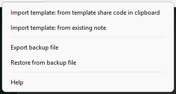

# 이 폴더는

이 폴더는 **Zotero Better Note 플러그인용 템플릿의 백업 파일**을 저장합니다.

## 이 프로젝트에서 템플릿의 역할 [KR]

**Zotero용 Better Notes**는 **모든 블로그 게시물 초안 작성이 시작되는 곳**입니다. 저자는 **마크다운**으로 글을 작성하고 **Pandoc 스타일 인용(`[@citekey]`)**을 노트에 직접 삽입할 수 있습니다.

이 프로젝트의 핵심 기능은 **고도로 맞춤화된 내보내기 템플릿**입니다. 이 템플릿은 다음을 보장합니다:

- **스마트 파일 출력**: 노트에 지정된 태그(여기서는 `o-m.kr`)가 있는 경우, 노트 제목과 Zotero 키를 기반으로 고유한 이름의 `.mdx` 또는 `.md` 파일을 생성합니다.
- **깔끔한 콘텐츠**: 초기 코드 블록, 인용문, 최상위 제목을 자동으로 제거하여 핵심 콘텐츠만 Astro에 게시되도록 합니다. 삭제한 부분을 메타데이터로 처리합니다. 자세한 내용은 아래를 참조하세요.
- **자동화된 프론트매터**: Astro 게시물에 대한 완전한 **YAML 프론트매터**를 동적으로 생성합니다:
  - 게시물 메타데이터(유형, 헤드라인, 요약/루브릭, SEO 친화적인 슬러그).
  - ISO 8601로 변환된 게시 날짜(생성, 릴리스).
  - 작성자 정보, 관련 Zotero 태그(특정 내부 태그 `o-m.kr` 제외), 및 키워드.
  - 이미지 및 개정 기록을 위한 플레이스홀더.
- **메타데이터용 HTML 파싱**: `DOMParser`를 사용하여 Zotero 노트 내의 HTML 요소(예: `<blockquote>`, `<pre>`)에서 특정 메타데이터(요약 및 슬러그와 같은)를 직접 추출합니다.

요약하자면, Better Notes는 Zotero 기반의 학술 콘텐츠를 Astro의 `rehype-citation` 및 관련 빌드 프로세스가 원활하게 게시하는 데 필요한 **구조화된 마크다운 출력과 풍부한 프론트매터**를 제공합니다.

## 이 폴더의 파일을 사용하는 방법

- 백업 파일은 템플릿 편집기 내의 모든 템플릿을 보관합니다.
- 따라서 기존 템플릿을 모두 삭제할 준비가 된 경우에만 `백업 파일에서 복원` 메뉴를 사용하십시오.
- 그 외의 경우에는 아래 순서에 따라 진행하십시오.

### 백업에서 Better Notes 템플릿을 복원하는 방법

사용자 지정 Better Notes 템플릿을 백업했다면, 복원하는 것은 간단합니다. 이 과정은 현재 Better Notes 템플릿을 백업 파일의 템플릿으로 교체합니다.

1. **Zotero 열기**: 컴퓨터에서 Zotero 애플리케이션을 실행합니다.
2. **Zotero 환경설정 액세스**:
   - Windows/Linux: `편집` > `환경설정...`으로 이동합니다.
   - macOS: `Zotero` > `설정...` (또는 이전 버전에서는 `환경설정...`)으로 이동합니다.
3. **Better Notes 설정으로 이동**:
   - 환경설정 창에서 왼쪽 사이드바의 `Better Notes` 탭을 선택합니다.
4. **템플릿 편집기 열기**:
   - "내보내기" 섹션에서 "템플릿" 드롭다운을 찾습니다. 수정하려는 템플릿을 선택하거나 복원하려는 경우 "사용자 지정"으로 설정되어 있는지 확인합니다.
   - 템플릿 드롭다운 옆의 `편집` 버튼을 클릭합니다. 템플릿 편집기가 열립니다.
5. **템플릿 내용 교체**:
   - 템플릿 편집기 창에서 **기존 내용을 모두 삭제**합니다.
   - Better Notes 템플릿 백업 파일의 **전체 내용을 복사**합니다.
   - 복사한 내용을 빈 템플릿 편집기에 **붙여넣습니다**.
6. **템플릿 저장**:
   - 템플릿 편집기에서 `저장` 버튼을 클릭합니다.
   - 템플릿 편집기 창과 Zotero 환경설정을 닫습니다.

이제 사용자 지정 Better Notes 템플릿이 복원되었으며, Zotero는 향후 노트 내보내기에 이 템플릿을 사용할 것입니다.