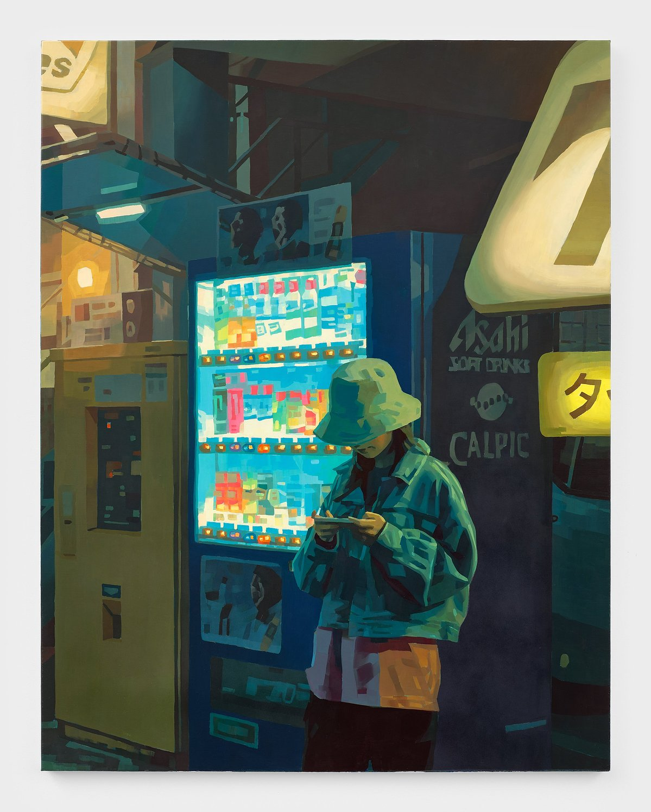
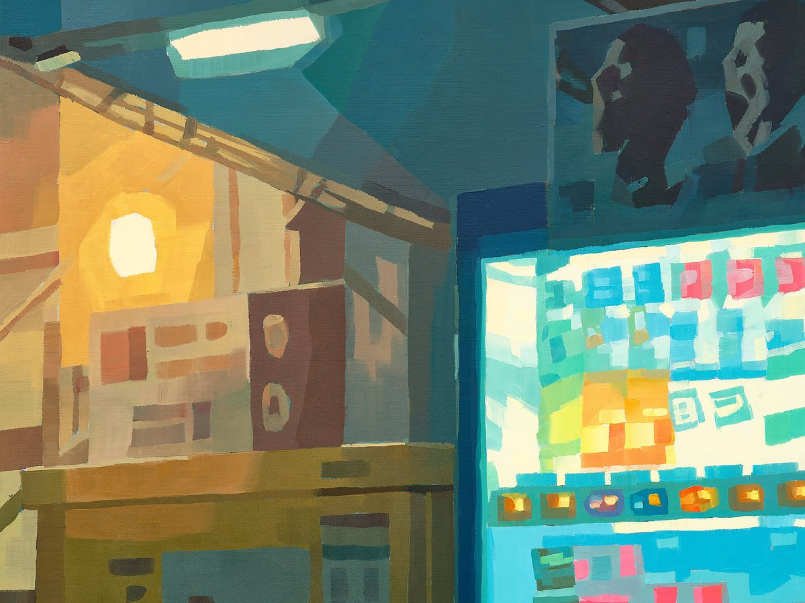

도시의 주인은 누구일까? 끝없이 이어지는 높다란 빌딩숲과 하루도 빠짐없이 미디어와 인터넷을 장식하는 얼굴을 떠올리지 않을 수 없다. 조선의 왕은 사라졌지만 서울의 왕은 여전히 강남 어딘가에서 천수를 누리며 우리를 지배하는 게 아닐까? 하지만 어둠이 도시를 집어삼키면 우리에게 남는 건 오직 빛뿐이다.

적어도 케이타 모리모토(Keita Morimoto)에게는 아닌듯 하다.\[@ossei-mensahKeitaMorimotoNowhere2025]

중세 회화 속 빛은 자애로운 여신이다. 화폭 모든 곳을 밝게 비춘다. 관람객은 지도 속을 유랑하는 여행객처럼 화면 곳곳에 자리잡은 자연과 인간을 짜맞추며 화가가 수놓은 이야기에 음미한다. 반면 플랑드르 회화 속 빛은

## 사람, 도시, 풍경, 우리는 모두 빛의 피조물

우리가 창조한 모든 대상은 그저 빛이라는 관광객을 위해 마련한 놀이기구에 불과하다. 자연의 일부인 사람, 그리고 사람이 일으켜 세운 도시라는 인공물이 만들어낸 수많은 요철은 빛

그렇게 우리는 빛 앞에 선 우리는 모두 창백하고 왜소한 조연배우가 되어 도시라는 무대를 거닌다. 이 화면의 주인공은 단 하나, 오직 빛 뿐이다. \[@rubsamKeitaMorimotoTurns2024]

## 빛은 입자, 파동 혹은 픽셀

사각형은 물질 단위가 아닌 논리 단위이다. 사각형은 입자 혹은 파동을 논리적으로 재해석한 단위다.

일그러진 사각형에서는 입자나 파동 같은 물질 단위의 흔적을 찾을 수 없다. 모니터 속 픽셀과 마찬가지로 일그러진 사각형은 논리 구조의 산물이다. \[@rashidHistoryArabicSciences2012]

익숙한 풍경이 이토록 낯선 이유는 뭘까. 구성 요소가 다르기 때문이다. 작가는 우리가 매일 발견하는 원과 곡선을 의도적으로 화면 속에서 배제했다.
