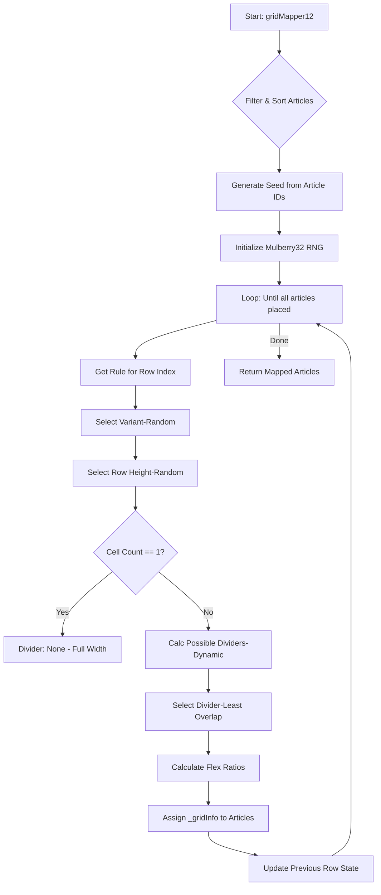

# Grid Mapper 12 (JSON + Deterministic) Architecture

이 문서는 `src/utils/grid-mapper.js`의 작동 원리와 핵심 로직을 설명합니다.

## 1. 핵심 개념: 결정론적 레이아웃 (Deterministic Layout)

이 매퍼의 가장 큰 특징은 **"콘텐츠가 동일하면 항상 똑같은 레이아웃을 생성한다"**는 점입니다. 일반적인 무작위(`Math.random()`) 방식을 사용하면 페이지를 새로고침할 때마다 레이아웃이 바뀌어 사용자 경험이 불안정해질 수 있습니다. 이를 해결하기 위해 **Seeded RNG(시드 기반 난수 생성기)**를 도입했습니다.

### 작동 원리
1.  **Seed 생성**: 현재 로드된 모든 아티클의 ID를 연결하여 고유한 해시(Seed) 값을 만듭니다.
2.  **RNG 초기화**: 이 Seed 값을 이용해 난수 생성기(`mulberry32`)를 초기화합니다.
3.  **일관된 생성**: 초기화된 RNG는 항상 동일한 순서로 난수를 배출하므로, 레이아웃 결정 과정(행 높이 선택, 분할 방식 등)이 100% 재현됩니다.

---

## 2. 로직 흐름도 (Logic Flow)



---

## 3. 주요 구성 요소

### A. 시드 생성기 (`generateSeed`)
아티클들의 고유 ID 문자열을 DJB2 해시 알고리즘을 변형하여 32비트 정수형 시드값으로 변환합니다. 아티클이 추가되거나 순서가 바뀌면 시드값이 완전히 달라져 새로운 레이아웃이 생성됩니다.

### B. 난수 생성기 (`mulberry32`)
자바스크립트 내장 `Math.random()` 대신 사용되는 커스텀 PRNG입니다. 시드값을 넣으면 항상 동일한 난수 수열을 반환합니다.

### C. 동적 분할 계산 (`getPossibleDividers`)
12열 그리드를 주어진 셀 개수(N)로 나눌 때, **최소 너비(3칸)** 조건을 만족하는 모든 가능한 조합을 재귀적으로 계산합니다.
*   예: 12열, 3셀 -> `[3, 3, 6]`, `[3, 4, 5]`, `[4, 4, 4]` ...

### D. 시각적 중복 방지 (`selectDividerWithLeastOverlap`)
바로 윗 행의 그리드 라인(Divider)과 겹치지 않는 분할 방식을 우선적으로 선택하여, "벽돌 쌓기" 같은 자연스러운 엇갈림 효과를 줍니다.

---

## 4. 데이터 구조 (`_gridInfo`)

매핑이 완료된 아티클 객체에는 다음 정보가 주입되어 컴포넌트(`Patchwork.astro`)에서 사용됩니다:

```javascript
article._gridInfo = {
  rowIndex: 0,          // 몇 번째 행인지
  cellIndex: 1,         // 행 내에서 몇 번째인지
  flexRatio: 4,         // Flex 비율 (너비)
  rowHeight: 6,         // 행 높이 단위
  totalCellsInRow: 3    // 행에 총 몇 개가 있는지
}
```

## 5. 변경 방법

*   **규칙 수정**: `src/utils/swiss/grid-rule-12-cols.json` 파일에서 행별 패턴이나 높이 옵션을 수정할 수 있습니다.
*   **새로고침 시 레이아웃 변경**: 개발 중 레이아웃 변경을 테스트하고 싶다면, 아티클 하나를 주석 처리하거나 ID를 임시로 변경하면 즉시 새로운 레이아웃이 생성됩니다.
